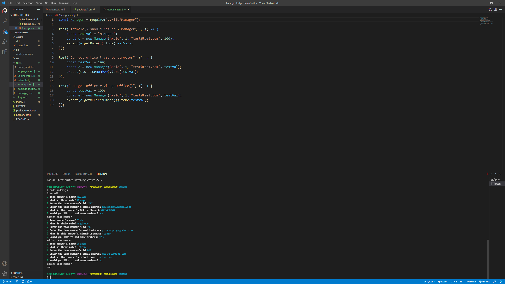
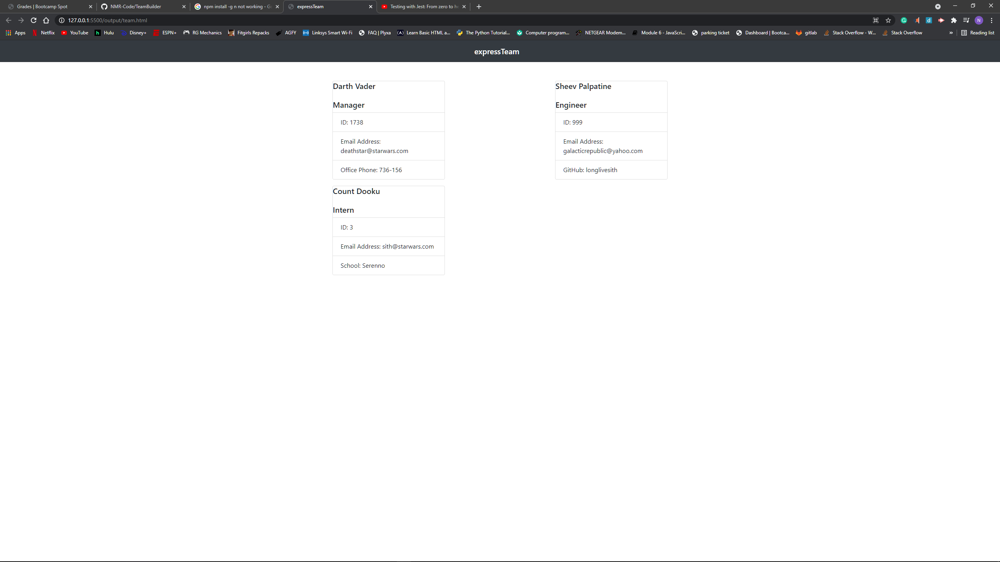
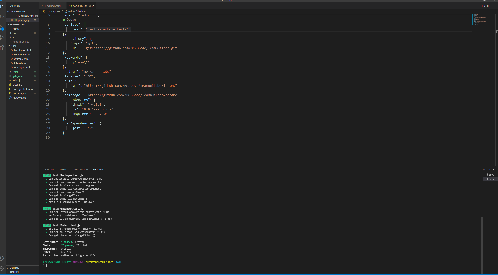

# expressTeamBuilder
 
## Licensing: 
    
## Table of Contents 
- [Description](#description)
- [Installation](#installation)
- [Usage](#usage)
- [Contribution](#contribution)
- [Testing](#testing)
- [Additional Info](#additional-info)

## Description:
A simple application to help you sort employees into various teams based on roles.

## Installation:
Download directly through GitHub via repository.

## Usage:
**To build a team** "node index.js"

## Contribution:
Looking forward to adding a ui interface with a button to add more teams.

## Testing:
**To test run** "npm test" 

## Additional Info:
- Github: [NMR-Code](https://github.com/NMR-Code)
- Email: nelsonog827@gmail.com 
- LinkedIn: Coming Soon!
